<div align="center">


</div>

**Real-time chess analysis, game review and automated play on Chess.com, Lichess, BlitzTactics, TakeTakeTake and
ChessBase Tactics.** Mephisto reads the position off the page, runs **Stockfish** (NNUE), **Fairy-Stockfish**, the
human-trained **Maia** nets or **Elite Leela** entirely in your browser - no server, no account - and draws the best
move on the board or plays it for you with human timing. It also reviews finished games, offline or through
**chess.com's own Game Review**.

Click the toolbar icon for a floating panel that stays open while you play.

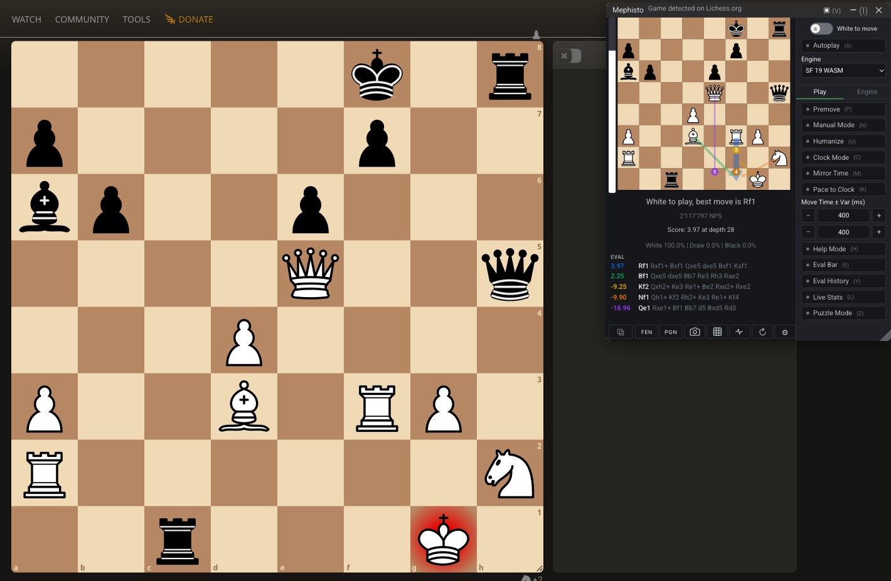

[Fair play](#fair-play---read-this-first) · [Install](#install) · [Engines](#engines) · [Features](#features) ·
[Sites](#supported-sites) · [Settings](#settings-reference) · [Footprint](#page-footprint) · [Roadmap](#roadmap)

---

## Fair play - read this first

**Using this in a live game against another person violates the Terms of Service of every chess site**, and account
closures are permanent and applied at the device level.

**This extension cannot make you undetectable.** What catches engine users is server-side and statistical: move
agreement over many games, think-time distributions, accuracy that doesn't fit your history. The anti-detection work
here only addresses *passive client-side fingerprinting* - a site noticing the extension is installed - which even
[the people writing detection for it](https://github.com/AlexPetrusca/Mephisto/issues/35) call a corroborating
signal, not grounds for a sanction.

**Genuinely good for:** reviewing your own games · openings and endgames · puzzles · engine development · analysis
boards and offline play · unrated games where your opponent knows. You are responsible for how you use this.

---

## Why this fork

An **actively maintained** continuation of [Mephisto by Alex
Petrusca](https://github.com/AlexPetrusca/Mephisto), whose scrapers no longer detect anything after the 2026
Chess.com and Lichess redesigns. Everything the original did still works. New here:

- **Game Review** - a full offline review (accuracy, move quality, eval graph, fair-play indicators), **and
  chess.com's own Game Review** on the same board, run from your own account.
- **Engines** - Stockfish dev / 18, the human-trained **Maia-1 / Maia-2 / Maia-3** and **Elite Leela**, an Elo cap
  and ten **playstyles**.
- **Playing like a person** - Humanize, Clock Mode, Mirror Time.
- **Automation** - Safe Premove, Pondering, Help Mode, Manual Mode, rebindable hotkeys.
- **Beyond the engine** - Opening Explorer, endgame tablebase, puzzle database.
- **On screen** - eval bar, eval history graph, screen reading, screenshot-to-FEN, a playable panel board.
- **Coverage** - chess.com variants, four-player chess, TakeTakeTake, Chess960, fourteen languages.
- **Under the hood** - a zero-iframe panel with no page-visible extension URLs, and settings export/import.

---

## Install

Distributed as an unpacked extension, not through the stores.

1. Download or clone this repository.
2. Open `chrome://extensions` and enable **Developer mode**.
3. **Load unpacked** → select the repository folder.
4. Pin it: puzzle icon right of the address bar → pin "Mephisto Chess Extension".

Every [release](https://github.com/IchNukeDichWeg/Mephisto/releases) carries two archives:

| Archive | Size | Use it when |
|---|---|---|
| `mephisto-<version>.zip` | **~690 MB** | **First install, always.** Everything, engines included. |
| `mephisto-<version>-update.zip` | **~6 MB** | **Already have it.** Code only - extract *over* your existing folder. |

Almost all of the full archive is bundled engines and nets, which change on very few releases; the update archive
leaves them alone.

> ⚠️ **Extract the update over your existing install, never into an empty folder** - both archives unpack into a
> `Mephisto-<version>/` folder, so copy that folder's *contents* over the folder Chrome already loaded. Extracting in
> place also keeps your extension id, which native engines are registered against.

To pick up a change: reload on `chrome://extensions`, then reload the game tab. The panel checks for a newer release
at most once every 12 hours, from the service worker, so the chess page never makes the request.

### Automatic updates (opt-in)

Chrome never updates an extension you loaded yourself, so Mephisto can - **Settings → General → Updates**, **off by
default**. Switch it on (Chrome asks for permission to download from this repository's releases), choose your
extension folder once, and updating is one button: it fetches the ~6 MB archive, writes it over that folder and
reloads the extension. The panel's update notice becomes that button.

It never installs by itself, never touches the bundled engines, refuses any folder that isn't this extension, and
checks the whole archive in memory before writing anything. The permission is scoped to this repository's downloads
and switching the feature off hands it back. Updating by hand still works exactly as before.

---

## Engines

Everything runs locally via WebAssembly - no server, no account, nothing leaves your machine. The two **online**
entries are the exception, and they are opt-in.

| Engine | Notes |
| --- | --- |
| **Stockfish dev NNUE** | Latest development build. Default. |
| **Stockfish 18 / 18 Small NNUE** | Full dual-net build (large net ships split, stitched at load), or the lighter net. |
| **Stockfish 11 HCE** | Classical eval, no NNUE - light and fast. |
| **Fairy-Stockfish 14 NNUE** | Required for [variants](#variants); each has its own bundled net. |
| **Maia-1** | The original Maia nets, one per rating band (**1100-1900**, plus **2200**). |
| **Maia-2** | One model taking **both** ratings, yours and your opponent's - a 1200 facing a 2000 does not play what a 1200 facing a 1200 plays. Two live steppers. |
| **Maia-3** | A transformer conditioned on a rating you set live, **600-2600**. |
| **Elite Leela** | A Leela net trained on the **Lichess Elite Database** (human games at 2200+). One forward pass: policy for the move, its own WDL head for the score. |
| **Tetrarch (4-player)** | Four-player chess only - see [four-player chess](#four-player-chess). One-time install. |
| **Remote / native** | A real engine binary outside the browser - see [full-power engines](#full-power-native-engines-optional). |
| **Stockfish 18 / 17.1 (online)** | Server-side Stockfish over HTTPS for a machine that cannot run one locally. **The position leaves your machine on every move**, one line only, so a local engine is both faster and private. Repeats inside 15s are answered from memory; stockfish.online takes only a depth, so selecting it switches the budget to Depth and back. |

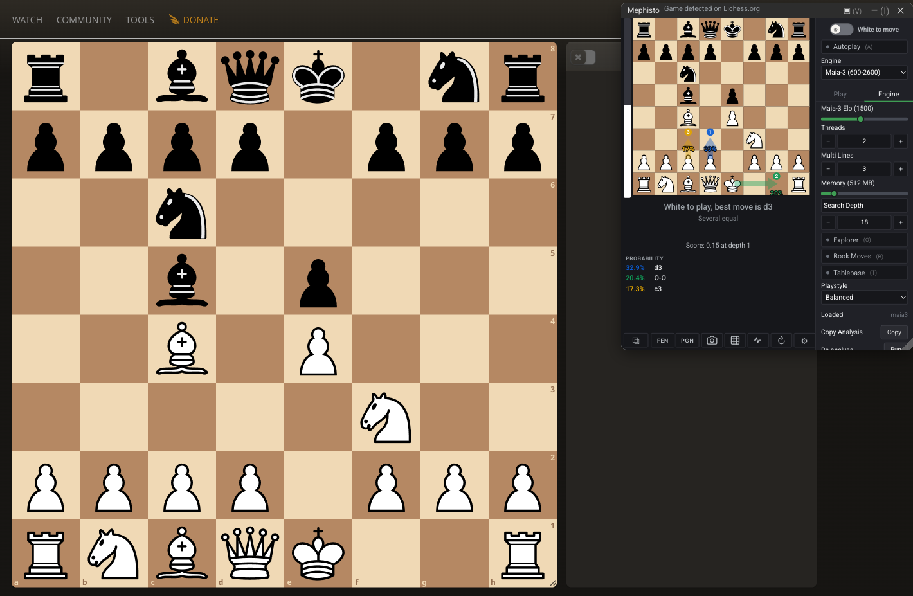 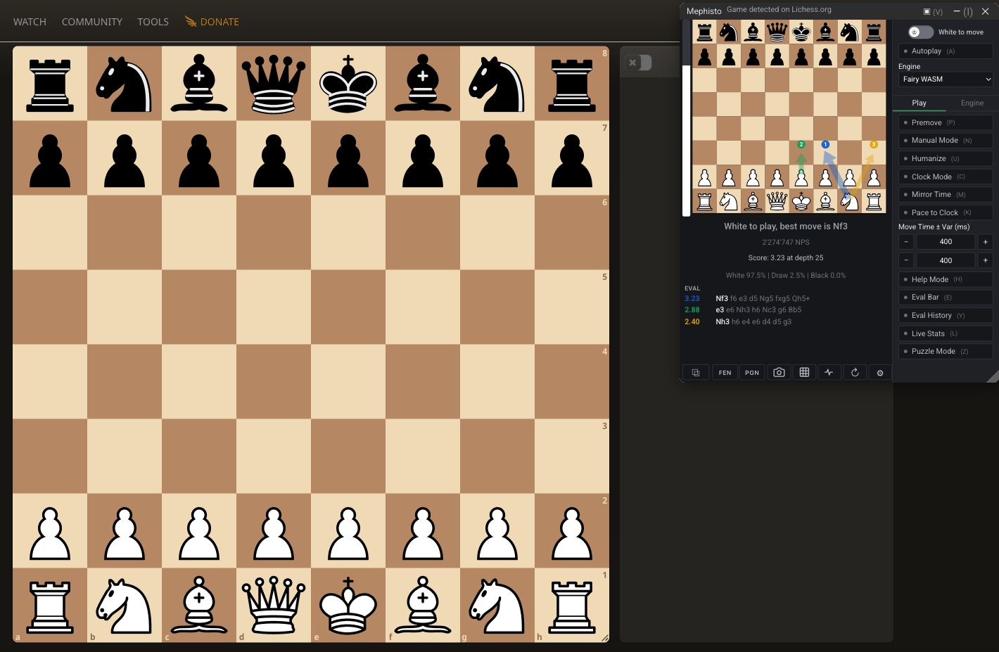

*Maia-3's live rating slider · Atomic analysed by Fairy-Stockfish*

Illegal scraped positions are blocked before they can crash the engine, and a crashed engine auto-restarts (3
attempts). **Strength cap** - limit any Stockfish/Fairy engine to a target Elo on a slider following that engine's
real `UCI_Elo` range.

### Variants

**Chess960** works on every mainline Stockfish. Fairy-Stockfish adds all of Lichess's variants (Crazyhouse, King of
the Hill, Three-Check, Antichess, Atomic, Horde, Racing Kings) plus Chess.com's **Duck, Minihouse, Seirawan and
Chaturanga**. The ↻ button beside the variant selector detects the variant and switches engine for you. The last four
have nets but the bundled chess.js can't replay them, so the panel says so rather than analysing the wrong position.

---

## Features

### Analysis in the panel

- **Multiple lines** (MultiPV), each drawn with its rank and score. On a human net the column shows each move's
  probability instead.
- **Eval bar** and a Lichess-shaped **eval history graph** marking opening / middlegame / endgame. After a move the
  bar holds the last settled reading until the new search reaches depth 6 rather than flashing 0.0; one-pass nets
  skip the wait.
- **Threat analysis** - the opponent's strongest reply. **Move confidence** - how much better best is than second.
  **Explain moves** - names the tactic, and stays quiet when it cannot be sure.
- **Opening Explorer** - the Lichess database: opening name, most-played replies with their W/D/L, coloured arrows.
  Masters, all Lichess, or a club band. Needs a personal API token (see that setting).
- **Read a position off the screen** - the camera button captures the tab, finds the board and loads it, on any site.
  **Follow screen** re-reads twice a second. Nothing is uploaded.
- **Playable panel board** - click or drag to walk a line, with underpromotion, and optionally walk the engine's own
  line with the arrow keys (off by default, so the site keeps them).
- **Second opinion** - a human-trained net answers the same position beside the engine, and says so when the two come
  apart: when the engine's move is one a player of that rating almost never finds.
- **Copy Analysis** - the position, the score with its depth and every candidate line, as text you can paste.
  **Re-analyse** searches the position on screen again from scratch; **Loaded** names the engine build and the net that
  actually answered.
- **Panel opacity and docking** - fade it over the board or park it against an edge, remembered per site.

 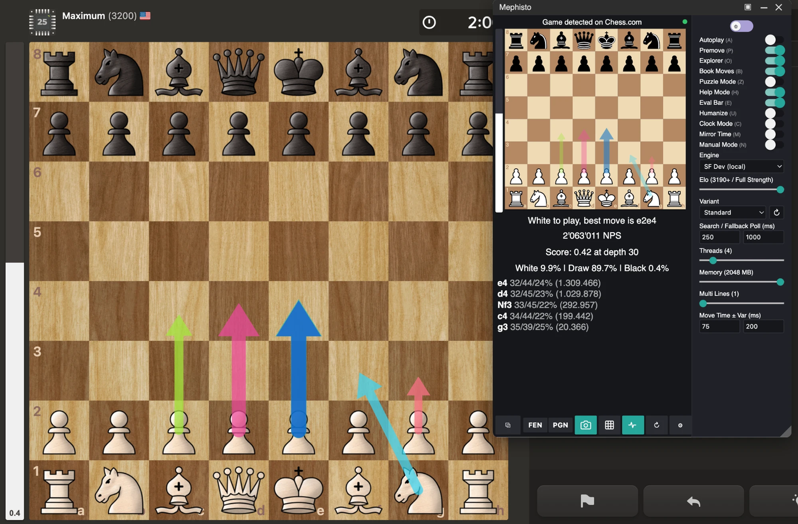

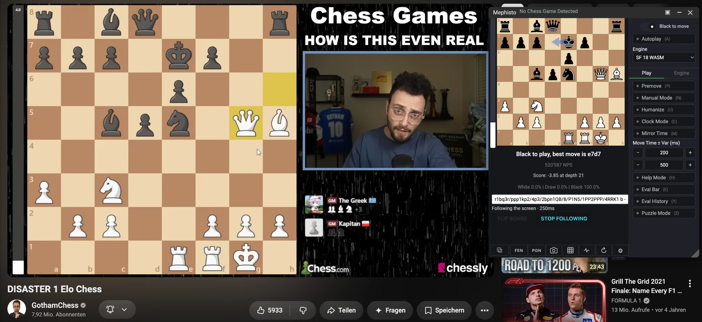

*Three candidate lines · the explorer's book moves · reading a position off a YouTube video, naming its
least-confident squares.*

### The Analysis page

A page of its own (**Settings → Analysis**) for studying rather than playing: a board you play on with a move list
and Copy FEN/PGN, the engine's lines **and** what a human of a chosen rating would play side by side, a search budget
in time or depth (or `go infinite`), W/D/L and an eval bar, and a loaded Polyglot book's moves for the position.
**Moves by rating** sweeps every candidate across the whole rating range as one chart, so you can watch e4 fall away
and d4 climb. **Compare nets** runs the same position through Maia-1, Maia-2, Maia-3 and Elite Leela and tabulates
what each one would play. Export writes one self-contained file - board, FEN, line, chart and the numbers behind it.

### Game review (offline)

**Settings → Game Review.** Paste a PGN, load a `.pgn`, or fetch recent games from Chess.com's or Lichess's public
API. **Nothing leaves your machine** during the review - the search runs in the extension's own engine.

- **Any game type** - chess, Chess960, the Fairy variants (own classification, pockets and check counts fed to the
  engine), and **4-player** PGN4 through Tetrarch, Teams or free-for-all.
- **Any engine at your budget** - bundled WASM or a native host, a reproducible depth (default 16) or a time per
  move, 1-10 lines, your own threads and hash. **Engines at once** (default 2) runs it as a worker pool - measured
  64.7s to 25.7s on the same game.
- **Accuracy and move quality** on Lichess's formulas and the same bands the panel judges live moves by, so a review
  agrees with what the panel said at the time.
- **Eval graph** with the phase boundaries marked, clickable; **openings named offline** from a bundled copy of
  [lichess-org/chess-openings](https://github.com/lichess-org/chess-openings) (CC0), keyed by position so
  transpositions are named; **think time** from the `[%clk]` comments.
- **Human model (optional)** - a Maia pass reporting where your move sat in *its* ranking. **Strength estimate
  (optional)** - which rating best explains the moves played, with the ratings it cannot tell apart, a per-phase
  breakdown, the moves the verdict rests on, and a compare-two-ratings view. A strength estimate, not a fair-play
  measurement.
- **Fair-play indicators** - engine-match rate over real choices, sharp positions, phases, longest streak, accuracy
  uniformity, whether long thinks went to hard positions. **Measurements, never a verdict.**
- **Review every game** in a file against one engine load, pooled per player. **Export** the report as one
  self-contained file.
- **Fit Humanize to a player** - every move in the review already carries its centipawn loss, and the Humanize move
  mix is defined in exactly those bands, so counting them gives the mix that reproduces that player. Measured, rather
  than guessed at with sliders.

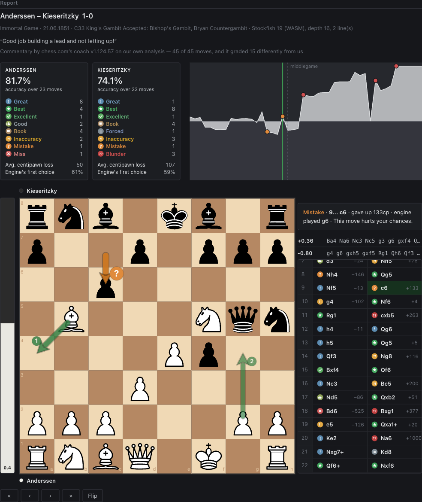

### chess.com Game Review

**chess.com's own Game Review, on Mephisto's board** - the real service, not an imitation. Load a game, press **Ask
Chess.com**, and every move comes back with chess.com's own verdict, the coach's commentary, both accuracies and the
named opening, plus the centipawn score behind the eval bar and graph.

It runs on **your own chess.com account** the way their site does - Diamond reviews without limit, a free account
gets the free-tier allowance - with no token or password to hand over; being signed in to chess.com in the browser is
the whole requirement. This is the one path that sends anything anywhere: the PGN goes to chess.com. The
[offline review](#game-review-offline) uploads nothing.

The strength tier is sent as chess.com's own ordinal 1-4 (Mephisto used to hardcode Standard). **Measured caveat:**
on a Diamond account with the cache defeated, their endpoint returns a byte-identical review for all four tiers, so
the field is correct but their server does not currently act on it.

### chess.com's classifier, offline

**chess.com's own move classifier, running on your machine - free, unlimited, network off.** It downloads chess.com's
own engines and their explanation engine and drives them the way their site does, so the verdicts are theirs: Book,
Brilliant, Great, Best, Excellent, Good, Forced, Inaccuracy, Mistake, Miss, Blunder, with the accuracies and the
one-line commentary.

Measured on nine diverse games (337 plies, ratings 1080-2812), each also reviewed by chess.com itself. **Decision
plies** exclude book moves, which both sides get free:

| what it reproduces | all plies | decision plies |
|---|---|---|
| **Post-game review** vs chess.com's free card | **96.2%** | **77.4%** |
| chess.com's free card vs **itself**, run twice | 94.1% | 64.2% |
| **Deep** vs their full **paid** Game Review | **86.7%** | **73.7%** |
| **Maximum / Standard / Fast** vs the same | 84.9 / 83.7 / 83.1% | 70.2 / 67.8 / 66.7% |
| *their own free card* vs their own paid review | *76.6%* | *53.8%* |

The post-game tier reproduces their card **more often than two of chess.com's own runs agree with each other**. The
ceiling has been measured too: feeding the classifier chess.com's *own* centipawns reaches 88.7%, not 100%, because
their reply carries no second line.

<details>
<summary>the five budgets, and the two downloads</summary>

The budgets are chess.com's **own depths**, not guesses: their settings select carries 18 / 22 / 24 / 26 and their
bundle maps those onto Fast / Standard / Deep / Maximum as `analysisDepth`. The post-game tier is their Stockfish 18
Lite at depth 10 with 2 lines, which is exactly what their free card runs locally; the four Game Review tiers run
their Stockfish **16.1** (measured 16.8cp mean difference from their review, against 24.3cp for 16, despite the
"Stockfish 16" label). **Deep is the one to pick**, not Maximum - d24 measures higher than d26 and costs less. MultiPV
3 scored worse than 2, and a 256 MB hash made no difference.

The classifier (28.7 MB, chess.com's commercial Torch build) and their Stockfish are fetched from chess.com on
request rather than shipped, then cached - after which the review runs **with chess.com unreachable**, verified with
the network cut. The game itself never leaves the machine on this path.

An earlier version of the table above claimed 95-96%; that campaign was 83% book moves, which is agreement that is
free. Nothing about the software changed, the measurement did.

</details>

### Automated play

- **Autoplay** plays the engine's move; **Help Mode** draws the arrows instead and overrides it.
- **Safe Premove** - certifies a reply to the opponent's *predicted* move: the same move at depth 13, depth 14 and
  the latest depth. An exact match fires instantly, anything else searches normally, so a wrong guess costs nothing. Forced moves and true recaptures queue
  as a real site premove; on chess.com a line forced two moves deep queues both.
- **Pondering** - the opponent's whole think at full threads over their top 5 replies. Off, their turn is capped at
  two threads (premove certification needs depth 14).
- **Play Book Moves** - the opening from the Explorer, weighted-random among replies with 20+ games and within 40cp
  of best. **Your own opening book** - load a Polyglot `.bin` and it plays from that instead, weights as given.
- **Endgame tablebase** - at ≤7 pieces the position is solved, so it outranks engine and book. Point it at your own
  Syzygy files and it answers off disk, offline - **Download tables** fetches them into that folder from lichess's
  own server, your choice of **3-4-5 men (0.9 GB), 6 men (149 GB) or both**, and **WDL, DTZ or both** (WDL says
  won/drawn/lost, DTZ is what converts a win and is most of the size). Anything already there with the right size
  is skipped, so a stopped download resumes. The lichess lookup is the fallback. Wins *convert*: moves follow
  lila-tablebase's own sort, and at ≤5 men the readout counts the mate. Off by default.
- **Tablebase Display** - at ≤7 pieces the engine and the tablebase both answer, and they answer different kinds of
  question: one searches, the other knows. **Both** (the default) draws the tablebase move as its own amber arrow
  beside the engine's numbered lines and prints both readings on the evaluation line -
  `Score: 2.31 at depth 24 / Tablebase: winning, DTZ 27`. **Tablebase only** leaves the solved move alone on the
  board; **Engine only** keeps the arrows and the score the engine's. Display only - the tablebase move is proved
  and the engine's is not, so it stays the move that gets played whichever you pick.
- **Refute my mistakes** - when a move of yours grades an inaccuracy or worse, the line that punishes it is drawn on
  the board. The badge says a move was bad; this shows what it loses.
- **Opponent prep** - what *this* opponent has played in the position in front of you, from their own recent public
  games. Longer games only (a clock of five minutes or more), and the lookup is made by the extension's worker, so
  your game tab never carries a request about the person you are playing.
- **Player book** - an opening book built from a real person's public games and *played*, weighted by how often
  they played each move. Your own username for your own repertoire (winning games only, by default), or
  anyone else's to borrow theirs. lichess and chess.com, `lichess:name` / `chesscom:name` to say which.
- **Time Trouble Mode** - below a threshold you set, the search is capped and the simulated human delay collapses to
  the floor a click still needs. At ten seconds it is the cursor travel that loses games, not the depth.
- **Auto Resign** / **Auto Draw Offer** - end a game that is over. The score has to stay past your threshold for
  three of *your* turns running, it presses the site's own button and confirms it, and it does so once per
  game. A draw is offered alongside the move; a resignation takes the move away.
- **Session Stats** - games, moves, the average delay each move really waited, and your accuracy across the
  session, on the readout line. The one number the pacing sliders cannot answer themselves.
- **Complexity Clock** - think by how hard the position is. When the engine's top two lines are within 15cp the
  think stretches to 1.6x; when one move is 250cp clear it drops to 0.6x. It scales whatever else is deciding
  the think, Humanize included, and the clock caps still sit above it.
- **Human Move Times** - draws the think from the shape real move times have (log-normal) instead of a flat
  band, keeping the average your sliders describe. Most moves come quickly, a few take several times the
  median, and none takes exactly nothing.
- **Play for the win** - contempt, for the game you cannot afford to draw. A move that ends the game as a draw on
  the spot (threefold, fifty-move, stalemate, insufficient material) is passed over for the best move that does
  not, up to the centipawns you are willing to spend. An ordinary position is never touched.
- **Variant endings are seen** - an exploded king, a third check, a king on the hill, the horde's last pawn.
- **Manual Mode** thinks indefinitely and plays only on your key. **Background Play** (off) defers moves that come
  due while the tab is hidden.

### Humanize

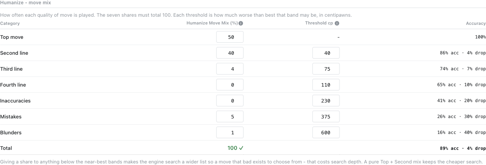

Seven shares set how often it plays the top move, a 2nd/3rd/4th line, an inaccuracy, a mistake or a blunder, with
per-category centipawn thresholds and a live [Lichess accuracy](https://lichess.org/page/accuracy) estimate of the
win-chance drop. Defaults sit on Lichess's own boundaries (110 / 230 / 377cp). Nothing past the blunder threshold is
played, and blunders never fire in a decided game.

Timing follows: quick on obvious moves, long thinks in critical positions, an instant reflex *only* for true
recaptures and forced moves. **Clock Mode** budgets each move off the page clock (~time/30 + 60% of the increment);
**Mirror Time** paces to a share of the opponent's last spend, 50-150% (90 by default), so it can deliberately
spend more than they do in a long game; being behind on the clock always cuts the target by a further 30%. Both size
the search to the wait. **Pace to Clock** (off)
shortens the *simulated* delay when the clock gets short, never lengthens it.

> **Priority** - *Time:* Mirror ▸ Clock ▸ Humanize ▸ Search Time. *Move:* Book ▸ Humanize ▸ engine best.

### Puzzles

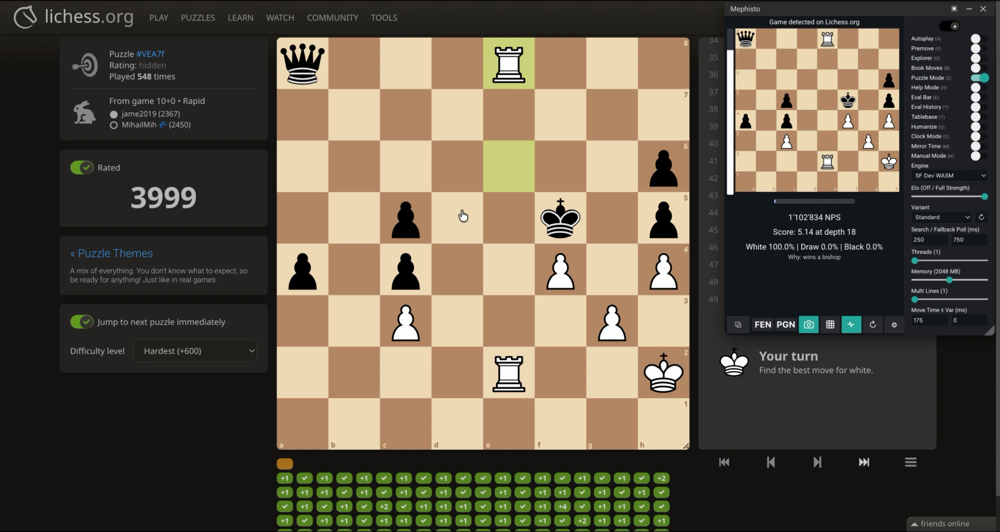 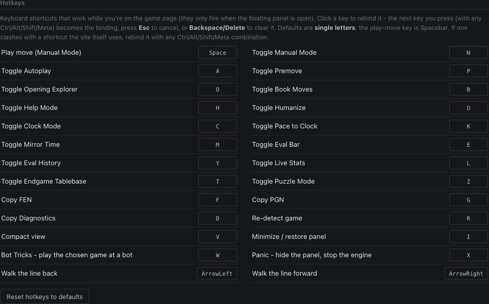

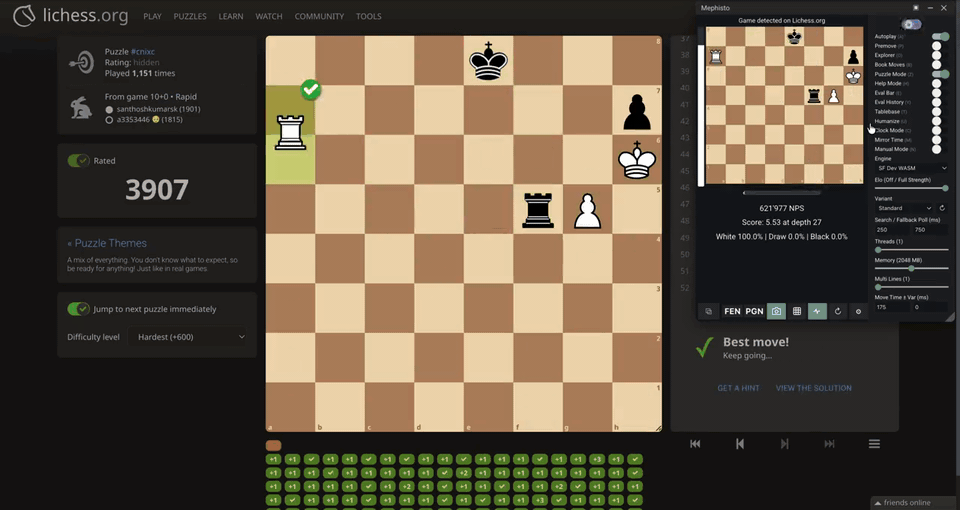

*3999 is the ceiling · every action rebindable · hardest (+600) puzzles back to back, from the database rather than
searched ([full clip](docs/puzzle-database.mp4)).*

**Puzzle Mode** optimises for solving speed. A puzzle page ships no move list, so the position is rebuilt from the
pieces alone - en passant from the last-move highlight, castling rights from the king and rook still at home.

**Puzzle database** - an objectively stronger move still fails a puzzle, so importing Lichess's database lets the
panel look the position up and play the whole solution with **no search at all**. Chess.com puzzles import too, in
their own format, detected from the file; both can be loaded at once.

**Read solutions from the page** (off by default) - the puzzle sites hand their own client the answer so they can
score you locally, so Puzzle Mode can read it there instead: no search, no database. A solution is used only if it
replays legally *and* belongs to the position on the board. Some chess.com modes fetch puzzles too early to watch,
which a second opt-in catches through Chrome's debugger at the cost of the yellow "being debugged" bar.

<details>
<summary><b>Importing the Lichess database</b> - about a gigabyte, roughly half an hour, once</summary>

Not bundled. Download `lichess_db_puzzle.csv.zst` from [database.lichess.org](https://database.lichess.org/#puzzles),
decompress it (`unzstd lichess_db_puzzle.csv.zst` - browsers have no zstd decoder), then pick the `.csv` under
**Settings → General → Puzzle Database**. About six million positions, live count as it goes, nothing sent anywhere.
An interrupted import loses nothing - run it again and it fills in the rest.
</details>

<details>
<summary><b>Building your own Chess.com puzzle CSV</b> - the format the importer accepts</summary>

**The header row is required and must begin with `fen3`** - that is the only thing distinguishing a Chess.com file
from a Lichess one. Columns, in this order: `fen3,id,rating,initialFen,tcnMoveList,colorOfUser,pgn,passRate,averageSeconds,gameLiveId,gameId`.
Only `fen3` (board + side + castling, the first two fields are the key), `id`, `tcnMoveList` and - for rated tactics -
`colorOfUser` are read; `daily-N` rows carry SAN in the move column and need `initialFen`.

**Whose move comes first differs by row type**, and getting it wrong shifts every solution by a ply: a rated tactic's
`fen3` is the *opponent* to move, so the importer applies that setup move and keys on the position after it, while a
`daily-` row's side to move **is** the solver.

**TCN** is two characters per move, index `0` = `a1`, `63` = `h8`, over
`abcdefghijklmnopqrstuvwxyzABCDEFGHIJKLMNOPQRSTUVWXYZ0123456789!?{~}(^)[_]@#$,./&-*++=`. A promotion pushes the
destination past 63: the piece is `"qnrbkp"[(to - 64) / 3]` and the destination `from ± 8 + ((to - 64) % 3) - 1`.

Write real CSV (the `pgn` column holds literal newlines and doubled quotes), key on the first three FEN fields only,
and branch on `id` before choosing an encoding. Unreadable rows are skipped, not fatal.
</details>

### The panel

Drag by the title bar, close with ✕. **Compact (▣)** collapses it to the status line; **minimize (–)** hides it behind
a badge while autoplay keeps running. Quick Settings edits every setting inline. **Re-detect (↻)** rescans the page.
**Copy FEN / PGN** (a custom start exports with `SetUp`/`FEN` tags; switch on **Evals In Copied PGN** and every ply
carries the panel's own `{[%eval] [%depth]}` from the game itself), a **grid button** takes a pasted FEN, **⧉** opens
the position on Lichess, and an **engine health dot** shows whether a native host answered.

---

## Supported sites

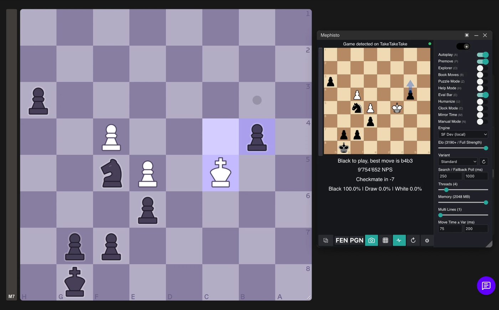

*TakeTakeTake, whose board is a WebGPU canvas with no DOM to scrape.*

| Site | Analysis | Autoplay | Premove | Puzzles | Online | Variants |
|---|:---:|:---:|:---:|:---:|:---:|---|
| **Chess.com** | ✅ | ✅ incl. Play Bots | ✅ | ✅ Rated · Rush · Learning + page-read solutions | ✅ | 3-Check, KotH, Crazyhouse, Antichess, Atomic, Horde, Racing Kings, **Duck, Minihouse, Seirawan, Chaturanga** + Chess960, **4-player** |
| **Lichess** | ✅ | ✅ incl. AI & From Position | ✅ | ✅ Training · Storm · Racer · Streak | ✅ live & correspondence | All Lichess variants + Chess960 |
| **TakeTakeTake** | ✅ | ✅ bot games | ✅ | - | ✅ Lichess-backed | - |
| **BlitzTactics** | ✅ | ✅ | - | ✅ puzzle streams | - | - |
| **ChessBase Tactics** | ✅ arrows on the canvas | ✅ | - | ✅ Solve / Sprint | - | - |

---

## Full-power native engines (optional)

**You don't need this.** The bundled WASM engines work with zero setup, but WASM is sandboxed - it can't use all your
cores or much RAM, so it runs **5-70× slower** than a native binary. Point Mephisto at a native Stockfish and Chrome
**auto-launches** it; there is no server to run.

<details>
<summary><b>Setup</b> - macOS, Linux, Windows</summary>

You need a native **Stockfish** (optionally **Fairy-Stockfish** for variants), **Python 3** with `python-chess`, and
your **extension ID** from `chrome://extensions` with Developer mode on.

> ⚠️ An unpacked extension's id **changes when you reload it**. If native engines stop working after a reload, re-run
> the install command with the new id.

**macOS**
```bash
brew install stockfish fairy-stockfish
python3 -m pip install chess
native-host/install-native.sh --ext-id YOUR_EXTENSION_ID
```
A binary downloaded from the web is quarantined by Gatekeeper - the installer clears that for its own copy.

**Linux**
```bash
sudo apt install stockfish
python3 -m pip install chess
native-host/install-native.sh --ext-id YOUR_EXTENSION_ID
```
For Fairy-Stockfish, install it or pass `--fairy /path/to/binary`.

**Windows** - native messaging needs a registry key, so this is manual: install Python and `pip install chess`,
download `stockfish.exe`, copy `native-host/uci-native-host.py` somewhere stable with a `sf-native.path` file beside
it holding the full path to the exe, write a host manifest `com.sf_native.host.json` (underscores - Chrome rejects
hyphens) pointing at a `.bat` that runs the host script with
`"allowed_origins": ["chrome-extension://YOUR_EXTENSION_ID/"]`, and add registry key
`HKCU\Software\Google\Chrome\NativeMessagingHosts\com.sf_native.host` = the manifest path.

The installer registers the host for **Chrome, Brave, Edge, Chromium and Vivaldi**. Firefox isn't supported for
native engines. Any native build unlocks full speed - the gap between native builds is small, the jump from WASM to
any of them is huge.
</details>

---

## Four-player chess

Chess.com's **4-player chess** (`/variants/4-player-chess`), analysed by
[Tetrarch](https://github.com/IchNukeDichWeg/Tetrarch) - a purpose-built engine for 14×14 four-seat boards. Pick
**Tetrarch (4-player)** in the engine dropdown; the panel switches to it on a four-player board and back when you
leave.

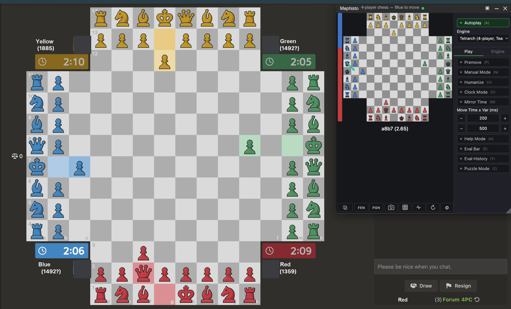

*Teams mode - the panel's own 14×14 board, rotated so you sit at the bottom, with the engine's move drawn on it.*

The evaluation is normalised to **your team** (Red+Yellow against Blue+Green) so it means one thing all game.
Autoplay works, on the analysis board too. **Free-for-all plays as well**, searched paranoid in the root seat's own
terms. Promotions are played in full - chess.com's picker is found by its shape rather than by a class name.
Chess.com's mode label decides the rules, and since promotion is the 8th rank in free-for-all and the 11th in Teams,
**Mode** in the panel overrides it by hand when that guess is wrong.

<details>
<summary><b>Setup</b> - macOS, Linux, Windows</summary>

Tetrarch is the one engine with nothing bundled behind it. Until it is installed the panel says so rather than
pretending to analyse. You need **Python 3**, a C compiler, and your **extension ID**.

**macOS and Linux**

```bash
git clone https://github.com/IchNukeDichWeg/Tetrarch
```

```bash
cd Tetrarch && ./setup.sh
```

Then, from the Mephisto folder:

```bash
native-host/install-native.sh --ext-id YOUR_EXTENSION_ID --tetrarch /path/to/Tetrarch
```

Drop `--tetrarch` if the checkout sits beside Mephisto's parent folder - that's where the installer looks.

**Windows** - the C core has to be built as a DLL and Chrome finds hosts through the registry, so there is a
PowerShell installer instead. Install [MSYS2](https://www.msys2.org), then from its **MINGW64** shell:

```bash
pacman -S --needed mingw-w64-x86_64-gcc
```

```bash
cd /c/path/to/Tetrarch && ./setup.sh
```

That produces `build\tetrarch.dll`. Then, from PowerShell in the Mephisto folder:

```powershell
powershell -ExecutionPolicy Bypass -File native-host\install-tetrarch.ps1 -ExtId YOUR_EXTENSION_ID
```

Add `-Tetrarch C:\path\to\Tetrarch` if the checkout isn't beside Mephisto's parent folder. No administrator rights
needed; Python 3 must be on `PATH`.

> The Windows path is **built and symbol-checked but not yet run on a real Windows machine**. If something
> misbehaves, [please open an issue](https://github.com/IchNukeDichWeg/Mephisto/issues/new/choose) - see
> [Contributing](#contributing) for the four stages worth reporting. **WSL** works today, since it's the Linux path.
</details>

---

## Languages

**Settings → Appearance → Language**, applied immediately without a reload. English, Deutsch, Español, Français,
Português, Italiano, Nederlands, Polski, Türkçe, Русский, 中文, हिन्दी, 日本語, 한국어 - each listed in its own language.

Deliberately **not** Chrome's `chrome.i18n`, which follows the browser's UI locale with no way to override it. One
flat JSON per language under `src/i18n/locales/`, English underneath as the fallback. Every string is translated
including the long settings tooltips. Engine names, themes and chess notation are left alone on purpose.

---

## Settings reference

Right-click the toolbar icon → **Options**, or the gear in the panel. Quick Settings in the panel is a subset writing
to the same storage, and everything applies to the next move without a reload. **Every setting explains itself in a
tooltip on that page, in all fourteen languages**, which is where the reference lives - it cannot go stale the way a
copy here would.

Four are worth knowing before you go looking:

| Setting | Why it matters |
|---|---|
| **Threads** / **Memory** | A fresh install takes half your cores. In-browser engines are clamped to 512 MB by the WebAssembly heap limit; native engines get the full value. |
| **Panel Style** | **Floating panel** lives in the page and is required for Autoplay and Premove. **Toolbar popup** leaves zero page footprint but closes when you click the board. |
| **Colour-blind palette** | One click on the Appearance page replaces every arrow colour with the Okabe-Ito set, which stays distinguishable under the common forms of colour blindness. The shipped colours separate lines by red against green, the one pair that collapses. |
| **Playstyle** | Ten characters chosen among lines the engine already called equal - *Attacking*, *Quiet*, *Greedy*, *Space*, *Sacrifice*, *Safe*, *Drawish*, *Ultra attacking*, *Disrespect*, and *Balanced* (the engine's own pick). Never at a cost: **35cp**, or two thirds of the top move's probability on a human net. Needs **Multi Lines ≥ 2**, and hides itself where it cannot apply. |
| **Lichess API token** | The Opening Explorer is behind OAuth now, so without one it answers 401. Make a personal token with **no scopes** ticked; it is sent nowhere but lichess and left out of diagnostics and exports. |

---

## Page footprint

**Toolbar popup** leaves **zero page footprint** - it renders in the browser's own chrome. It closes when you click
the board, so it is analysis only; Autoplay and Premove need the floating panel (**Settings → General → Panel
Style**). While the floating panel is in use:

- **No iframe.** An iframe is a browsing context, counted by `window.length` and impossible for a closed shadow root
  to hide. The panel renders in the page's isolated world; the WASM engine lives in an offscreen document.
- **No extension URLs reach the page.** `web_accessible_resources` is gone; markup, CSS and images are injected as
  inlined bytes or `data:` URIs, so no `chrome-extension://` URL appears in the DOM or in Resource Timing.
- **Closed shadow root** under one attribute-less host node.
- **No branded page globals** - MAIN-world probes talk over per-session random event channels.
- **Human-shaped clicks** - a bare *from → to*, randomised timings, a center-weighted landing point, and a jittered
  cursor path whose *shape* is measured rather than assumed: `test/cursor-oracle.mjs` records the `mousemove` stream a
  click actually emits, which is the only thing a site can see. Its numbers stay in its output - a published table of
  where a path peaks is a signature to match against. It caught the previous path signing itself (a smoothstep ease
  and a `sin` bow are both symmetric, so every move peaked at its midpoint), so the ease is now a shifted logistic and
  the arc a cubic Bezier, both randomised per move. Duration is priced by **Fitts's law**, and a share of long moves
  overshoot and correct.
- **Lookups about your opponent leave from the worker, never the tab**, so they are not attributable to the page.
- **Nothing loads on a page that does not need it** - the classifier is injected only when one of its three opt-in
  features is on.
- **No config in the site's storage.** Two values do sit in page storage because they are read while the panel is
  built; neither is named after the extension nor holds a setting.

These reduce *passive* fingerprinting only. See the [disclaimer](#fair-play---read-this-first).

---

## Roadmap

No schedule - added whenever I feel like it. **Shipped work lives in the
[releases](https://github.com/IchNukeDichWeg/Mephisto/releases)**, each with its own notes.

**Worth real work.**

- [ ] **Review the game you just finished, in one click** - the content script is already holding the moves.
- [ ] **Turn your own blunders into puzzles** - the review finds them, Puzzle Mode serves them; the bridge is missing.
- [ ] **A command palette** - one key and a search box over the actions the hotkey system already names.
- [ ] **Grind Mode, the rest of it** - stop after N games or a losing streak, respect a daily limit, pick the time
  control, and know whether you are still at the keyboard.
- [ ] **Talking Mode** - a running commentary in plain language instead of a number and an arrow.
- [ ] **Drill mode** - the puzzle database, the explorer's statistics and Maia at a rating band, pointed at a
  repertoire.
- [ ] **Your history across games** - accuracy over time, which openings actually lose.

**Known problems.**

- [ ] **Playing while the machine is busy** - measured on a saturated 10-core Mac: the panel's response went from a
  323ms median to 1239ms. Fewer engine threads under load made it *worse*, so the cost is the page thread. Overlay
  redraws are now coalesced to one per animation frame (v3.1.302, with `overlay=` and `scrape=` in diagnostics);
  **the confirming saturated-machine run is still owed**.
- [ ] **The pause after a browser restart** - unresponsive for several seconds, then it recovers. Never explained;
  the worker's cold-start timings are recorded now.
- [ ] **Four-player chess, the rest of it** - no real game has been seen past an elimination, so that path is pinned
  by synthetic positions. Chaturaji, 4P Giveaway and Self Partnering are untouched.
- [ ] **Four-player chess on Windows, confirmed** - built and symbol-checked, never run on real Windows.
- [ ] **Duck Chess autoplay** - blocked on the engine: this Fairy build declares 84 variants and duck is not one, so
  it needs a rebuild, not a wiring job.
- [ ] **Better board reading from the screen** - unusual piece sets, low resolution, boards at an angle. That is the
  model, so it means retraining rather than tuning.
- [ ] **A speed and polish pass on the panel** - every control compared against the one beside it, the way the
  settings page was swept.
- [ ] **Shrink the footprint further** - the client side is nearly exhausted, and it was never what catches people.
- [ ] **More engines** - variety of character rather than more strength. Ten playstyles (v3.1.303) and the human trio
  (Maia-1 band, Maia-2 matchup, Maia-3 dial) plus Elite Leela cover a lot of it; what is open is a net that is not an
  lc0 net. **lc0 (Leela)** in WASM would be for comparing styles.
- [ ] **Short videos and more screenshots** · [ ] **Translate the README**.

**Speculative.** Mirroring another bot (doubles the footprint, and the shape of the moves is what catches people
anyway); an LLM at the board (bad at moves, interesting as the voice behind Talking Mode).

**Always open.** Bug fixes - several of the sharpest so far were invisible rather than loud, so *"it did nothing"* is
worth more than it sounds. And whatever you want it to do; most of what is here arrived because something was
annoying in a real game.

**Blocked upstream** - no engine supports them: Fog of War, Spell Chess, Bughouse, Chess-with-Checkers.

**Looked at and dropped.** *Lichess cloud evaluation* is a crowdsourced cache, deep on openings and absent on
ordinary middlegames - the inverse of where extra depth would change a move. *Training more Maia bands* would
duplicate Maia-3's 600-2600 slider, and human data thins out exactly where a new band would have to prove itself.

---

## Contributing

**[Open an issue](https://github.com/IchNukeDichWeg/Mephisto/issues/new/choose) for anything** - a bug, a site that
stopped being scraped, an engine that misbehaves, a feature you want, an idea. You don't need a diagnosis; "it
stopped playing moves on lichess this morning" is a perfectly good issue. PRs welcome too.

**Paste a diagnostics report into the issue** - press **D** on the page, or the panel's **Engine** tab → **Copy
Diagnostics**. It carries the build, the engine, what was detected, whether the last move played and why not if it
didn't, and the recent trace, with **no addresses, no account, no token and nothing identifying**. Two things sharpen
it: turn on **Verbose Logging** first and reproduce the problem, and **copy while it is broken** - reloading to get a
clean report throws away the state that explains the fault.

**If the Windows four-player setup fails, say which stage broke** - each has a different cause: (1) `./setup.sh`
produces `build\tetrarch.dll`, (2) `python -c "from tetrarch import core"` imports, (3) `python uci.py` answers `go`
in a terminal, (4) the panel finds the engine in Chrome.

## License & credits

This project's own source (and the original [Mephisto](https://github.com/AlexPetrusca/Mephisto) by Alexandru
Petrusca) is **MIT** ([`LICENSE`](LICENSE)). It **bundles copyleft components** - GPL-3.0 engines and nets, and the
**AGPL-3.0** Maia-3 model - so the **combined distribution is governed by AGPL-3.0**. Before redistributing, read
[`LICENSING.md`](LICENSING.md) and [`THIRD-PARTY-NOTICES.md`](THIRD-PARTY-NOTICES.md); full texts in
[`licenses/`](licenses/).

Built on the work of others, with thanks:

- **[Stockfish](https://github.com/official-stockfish/Stockfish)** & **[Fairy-Stockfish](https://github.com/fairy-stockfish/Fairy-Stockfish)** (GPL-3.0), run in the browser via the [Lichess Stockfish-web](https://github.com/lichess-org) builds.
- **[Maia](https://github.com/CSSLab/maia-chess) / [Maia-2](https://github.com/CSSLab/maia2) / [Maia-3](https://github.com/CSSLab/maia3)** (CSSLab, University of Toronto; GPL-3.0 / MIT / AGPL-3.0), the **[Maia 2200](https://github.com/CallOn84/LeelaNets)** and **Elite Leela** nets (CallOn84; GPL-3.0), and **[Leela Chess Zero](https://github.com/LeelaChessZero/lc0)** (GPL-3.0) for the input/policy encoding.
- **Board recognition** - two models from [Chess_diagram_to_FEN](https://github.com/tsoj/Chess_diagram_to_FEN) by Jost Triller (MIT), converted to ONNX; see `lib/engine/vision/`.
- **[ONNX Runtime Web](https://github.com/microsoft/onnxruntime)** (Microsoft; MIT) - in-browser inference.
- **Polyglot book format** - the 781 Zobrist constants a `.bin` book is keyed by (`lib/polyglot-random.js`), from Polyglot via **[python-chess](https://github.com/niklasf/python-chess)** (Niklas Fiekas; **GPL-3.0**). They are the format's published data: a book cannot be read without exactly those values. The reader itself is this project's code.
- **[chess.js](https://github.com/jhlywa/chess.js)** (BSD-2), **[chessboard.js](https://github.com/oakmac/chessboardjs)**, **[jQuery](https://jquery.com)**, **[Materialize](https://materializecss.com)** and `lru` (all MIT).
